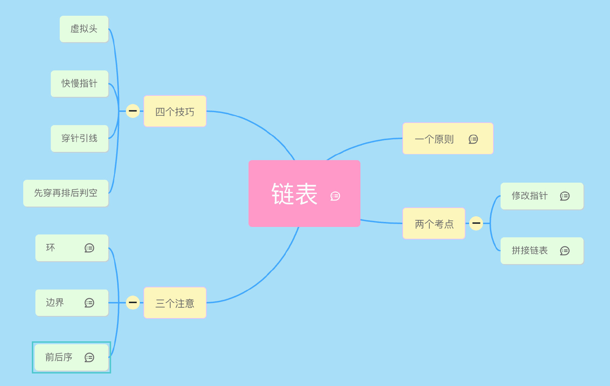
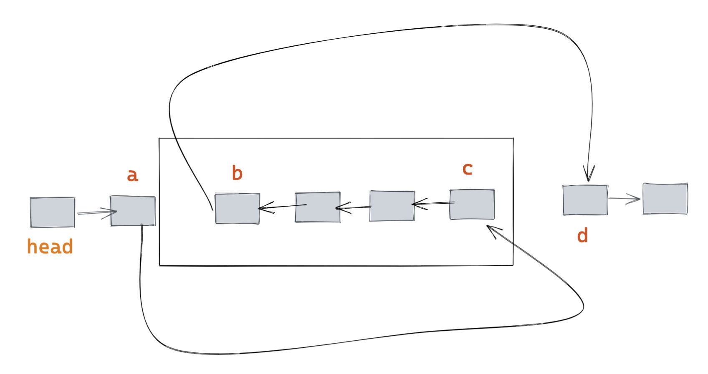

# 链表

## 一个原则

一个原则就是画图

## 四个技巧

### 1. 虚拟头指针

懂得都懂。

### 2. 快慢指针

例如：找链表中间的节点、两个指针，一个一次走两步，一个一次走一步；找倒数第 2 个节点等。

### 3. 穿针引线

例如：拼接链表类，包括反转链表、旋转链表等，给个图就明白了：

### 4. 先穿再排后判空

这里的意思是先修改指针，再对修改指针的顺序排序，然后再判断是否需要判空。

## 题目推荐

- [21. 合并两个有序链表](https://leetcode-cn.com/problems/merge-two-sorted-lists/)
- [82. 删除排序链表中的重复元素 II](https://leetcode-cn.com/problems/remove-duplicates-from-sorted-list-ii/)
- [86. 分割链表](https://leetcode-cn.com/problems/partition-list/)
- [92. 反转链表 II](https://leetcode-cn.com/problems/reverse-linked-list-ii/)
- [138. 复制带随机指针的链表](https://leetcode-cn.com/problems/copy-list-with-random-pointer/)
- [141. 环形链表](https://leetcode-cn.com/problems/linked-list-cycle/)
- [142. 环形链表II](https://leetcode-cn.com/problems/linked-list-cycle-ii/)
- [143. 重排链表](https://leetcode-cn.com/problems/reorder-list/)
- [148. 排序链表](https://leetcode-cn.com/problems/sort-list/)
- [206. 反转链表](https://leetcode-cn.com/problems/reverse-linked-list/)
- [234. 回文链表](https://leetcode-cn.com/problems/palindrome-linked-list/)